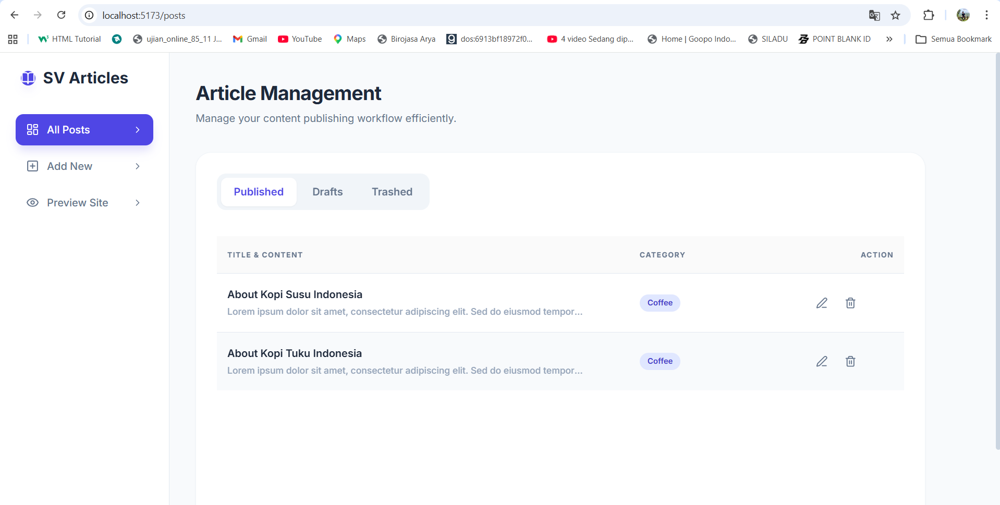
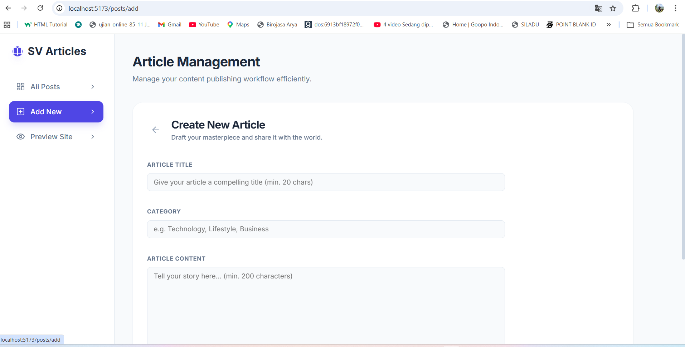
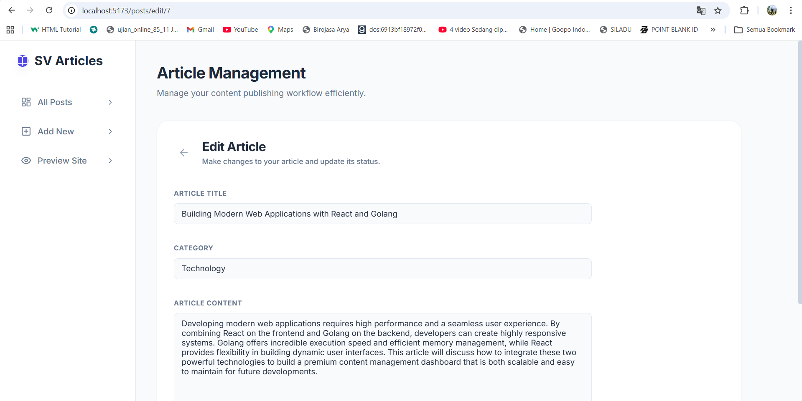
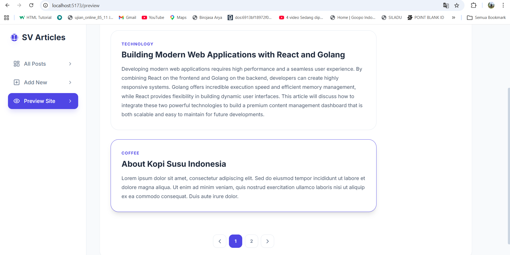

## Getting Started

### 1. Run Backend
Ensure your backend (Go) and Database are running.
```bash
# Start MySQL via Docker in the backend folder
docker-compose up -d

# Run the Go server
go run main.go
```
The API should be accessible at `http://localhost:8080`.

### 3. Run Frontend
Navigate to this folder and run:
```bash
# Install dependencies
npm install

# Start the development server
npm run dev
```
Open [http://localhost:5173](http://localhost:5173) in your browser.

## Features Implemented
- **Dashboard Layout**: Sleek sidebar navigation with active states.
- **All Posts Management**: 
    - Dynamic Tabs (Published, Drafts, Trashed).
    - Table view with Title, Category, and Actions.
    - Soft delete (Move to Thrash) functionality.
- **Add New Article**: Complete form with validation (Title, Content, Category).
- **Edit Article**: Pre-filled form to update existing articles via PUT request.
- **Public Preview**: Blog-style view for published articles with Pagination.

## Screenshots Preview

### All Posts Dashboard


### Add New Article


### Edit Article


### Public Blog Preview & Pagination

